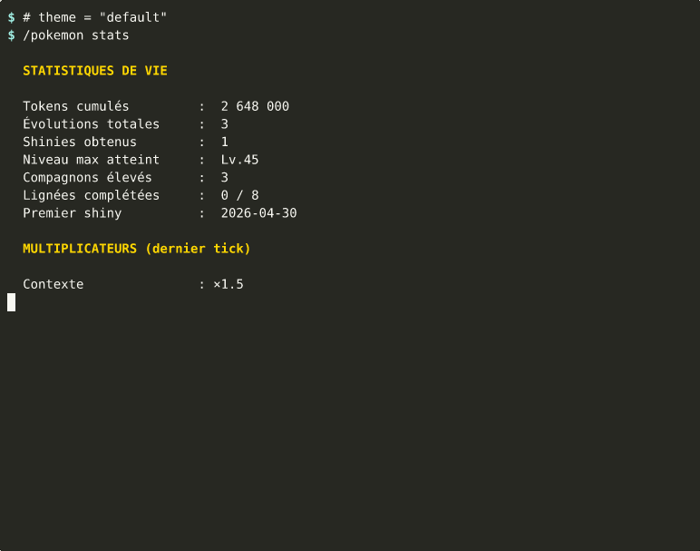
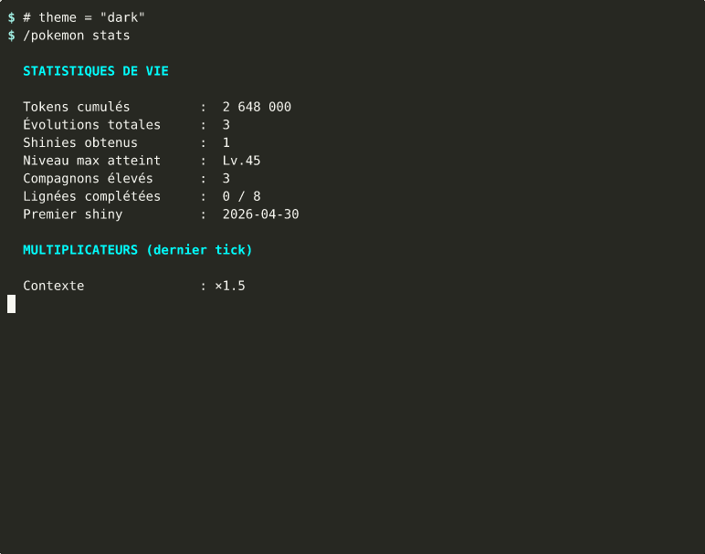
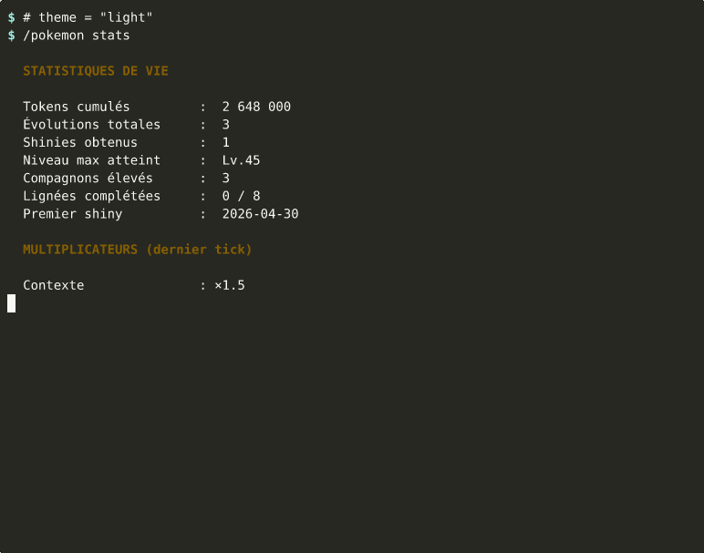
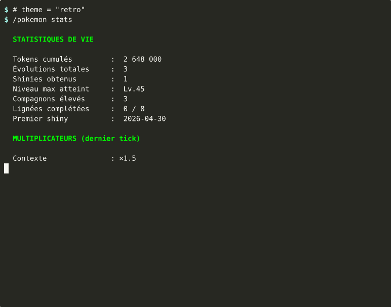
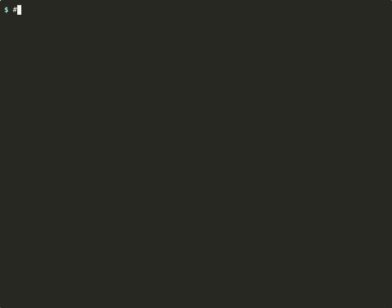

# 🐉 claude-pokemon

A persistent **Pokémon companion** for [Claude Code](https://claude.com/claude-code)'s `statusLine`. Hatch eggs, evolve, switch teams, catch wild Pokémon — all while you code.

<p align="center">
  
</p>

## Features

- 🥚 **Hatch your starter** : Bulbasaur, Charmander, Squirtle, Pikachu, Eevee — and Gen 2 Johto starters (Chikorita, Cyndaquil, Totodile)
- 🌟 **Pokémon-canonical XP curve** (Medium Slow, Lv.0 → Lv.100). Hatch threshold rebalanced to 300K (achievable in first day of real use)
- ✨ **Shiny system** : 1/100 chance, +25% with Shiny Charm after first
- 🐊 **Mega evolutions & Gigamax** at Lv.55 / Lv.100 (Hisuian Typhlosion for Gen 2 Fire)
- 🏆 **15 Achievement badges** including Master badges per lineage
- 👥 **Team management** (6 max) + unlimited PC storage
- 📖 **Pokédex Gen 1+2** (251 wild encounters)
- 🎨 **4 UI themes** : `default` (gold), `dark` (cyan), `light` (sepia), `retro` (GameBoy green monochrome)
- ❓ **Mini-game** `/pokemon game` : guess the Pokémon from hints (+500 XP reward)
- 📡 **Optional shared stats** : `/pokemon stats-share enable --confirm` → opt-in anonymous leaderboard via Cloudflare Worker (set a public pseudo via `name <pseudo>`, GDPR-compliant `forget` to delete)
- 🥋 **Battle system** (30% of encounters → win/lose, XP bonus or injured status)
- 🎁 **Held items** (XP Charm, Lucky Egg, Soothe Bell, Berry)
- 🔄 **Trade simulation** (1/day random Pokémon)
- 🎃 **Seasonal events** (Halloween, Christmas)
- 💖 **Friendship counter** (gates Eevee → Espeon/Umbreon evolutions canonically)
- 🌍 **i18n** : Français + English (more languages welcome via PR)

## Install

```bash
npx claude-pokemon install
```

The installer will:
1. Verify prerequisites (`jq`, `chafa`, `flock`, `curl`, optionally `gifsicle`)
2. Create `~/.claude/pokemon/` with default config
3. Download ~50 Pokémon sprites from Pokémon Showdown (~1MB)
4. Patch your `~/.claude/settings.json` (non-destructive — backups created)
5. Install the `/pokemon` skill

Then **restart Claude Code** and type `/pokemon`.

## Prerequisites

| Tool | Required | Why |
|---|---|---|
| `jq` | yes | JSON parsing/manipulation (state, data) |
| `chafa` | yes | PNG → ANSI sprite conversion |
| `flock` | yes | concurrent state.json write protection |
| `curl` | yes | sprite download |
| `awk` | yes | float arithmetic |
| `gifsicle` | optional | (replaced by Python+PIL pipeline) |
| `python3` + `Pillow` | optional | sprite animations (5 frames idle bobbing per Pokémon) |

**Linux (Debian/Ubuntu)** :
```bash
sudo apt install jq chafa util-linux curl gifsicle
```

**macOS (Homebrew)** :
```bash
brew install jq chafa util-linux curl gifsicle
```

<a id="windows-users"></a>
**Windows users (WSL required)** :

The CLI requires a POSIX shell environment (bash, chafa, flock, POSIX paths). Native Windows isn't supported, but **WSL works perfectly** :

```powershell
# In PowerShell (admin, one-time)
wsl --install
```

Then in your WSL terminal :
```bash
sudo apt install jq chafa util-linux curl gifsicle
npm install -g claude-pokemon
npx claude-pokemon install
```

The upcoming **web arena** (Phase 2 of the [roadmap](ROADMAP.md)) will let you consult the leaderboard, trainer cards, and global stats from any browser — no CLI needed for the social features.

## Usage

After install, in Claude Code :

```
/pokemon              # Vue principale du compagnon (sprite + stats)
/pokemon team         # Équipe (6 max)
/pokemon pc           # PC storage
/pokemon pokedex      # 5 lignées élevées + 151 sauvages Gen 1
/pokemon stats        # Stats de vie cumulées + multiplicateurs actifs
/pokemon badges       # 12 badges (acquis + verrouillés)
/pokemon inventory    # Items + pierres d'évolution
/pokemon switch <n>   # Échanger l'actif avec team[n]
/pokemon hatch [<l>]  # Nouvel œuf (lignée optionnelle)
/pokemon deposit <n>  # team[n] → PC
/pokemon withdraw <n> # PC[n] → team
/pokemon release <area> <n> --confirm   # Relâcher (irréversible)
/pokemon give <item>  # Équiper un item tenu
/pokemon take         # Retirer l'item tenu
/pokemon trade        # Échange (1/jour)
/pokemon reset        # Reset cérémonial
/pokemon --shiny      # Toggle shiny manuel
```

## Customization

Edit `~/.claude/pokemon/data.json` to tune everything :

```json
{
  "language": "fr",                          // "fr" | "en"
  "starter_pick": "random",                  // "random" | "fire" | "water" | "grass" | "electric" | "eevee"
  "shiny_mode": "random",                    // "random" | "always" | "never"
  "shiny_chance": 0.01,                      // 1/100 by default
  "shiny_hunter_mode": false,                // Toggle: ×5 shiny chance, but XP frozen
  "display_sprite_in_statusline": "left",    // "left" | "above" | "off"
  "enable_animations": false,                // Requires gifsicle
  "thresholds": [...],                       // 101 values, Lv.0 → Lv.100
  "lineages": {...},                         // Stages, types, moves, descriptions
  "wild_pool": [...],                        // 151 Gen 1 Pokémon
  "berries": [...],                          // Berry events drop pool
  "items": {...},                            // Evolution stones + held items
  "event_chances": {                         // Random event probabilities per tick
    "berry": 0.005,
    "encounter": 0.001
  }
}
```

**Switch language on the fly** :
```bash
jq '.language = "en"' ~/.claude/pokemon/data.json | sponge ~/.claude/pokemon/data.json
```

## Themes

`data.json.theme` accepts `default` / `dark` / `light` / `retro`. The first three only retint the accent color (titles, gauges ≥75%, badge dates, shiny stars). `retro` goes further and collapses the full stage/type palette to a 4-tone GameBoy green for a monochrome DMG vibe.

<table>
  <tr>
    <td align="center"><sub><b>default</b> — gold accent (current)</sub><br></td>
    <td align="center"><sub><b>dark</b> — electric cyan</sub><br></td>
  </tr>
  <tr>
    <td align="center"><sub><b>light</b> — sepia (readable on light terminals)</sub><br></td>
    <td align="center"><sub><b>retro</b> — GameBoy DMG green</sub><br></td>
  </tr>
</table>

```bash
jq '.theme = "retro"' ~/.claude/pokemon/data.json | sponge ~/.claude/pokemon/data.json
```

<details>
<summary>Voir l'animation des 4 thèmes (GIF)</summary>

<p align="center">
  
</p>

</details>

## Share your stats — README badge

Once you've opted in to shared stats (`/pokemon stats-share enable --confirm` then `submit`), you can embed a live badge of your stats on your GitHub README, profile, blog, etc. The badge auto-refreshes (5min cache) and shows your active companion + key lifetime stats.

<p align="center">
  
</p>

```markdown

```

Replace `<your-anon-id>` with your local `anon_id` (visible via `/pokemon stats-share status`). Want a public pseudo to display instead of the raw id? Set one with `/pokemon stats-share name <pseudo>` (charset `[a-zA-Z0-9_-]`, 2-24 chars), then re-submit.

## Mechanics

### XP Curve

Medium Slow formula (Pokémon canonical) :
```
XP(L) = 1.2·L³ – 15·L² + 100·L – 140
threshold[L] = 500_000 + max(0, XP(L)) · 300
```

| Level | Tokens needed |
|---|---|
| Lv.1 (hatch) | 500K (~30 min chat) |
| Lv.16 (Reptincel) | 1.26M |
| Lv.36 (Dracaufeu) | 12.5M |
| Lv.55 (Mega) | 48M |
| Lv.100 | 318M |

### XP Multipliers (compounded per tick)

| Multiplier | Range | Trigger |
|---|---|---|
| Context | 0.5× – 2.0× | Lower context = bigger boost |
| Type matchup | 1.0× – 1.2× | Lineage-specific (Fire low ctx, Water high ctx, etc.) |
| Daily bonus | 1.0× / 1.5× | First tick of new day |
| Status | 0.75× / 1.0× | Tired (5+ ticks at >90% ctx) |
| Held item | 1.0× / 1.1× / 1.15× | XP Charm / Lucky Egg |
| Season | 1.0× / 1.5× | Halloween (Oct 25-31), Christmas (Dec 20-31) |

### Evolutions (canonical levels)

| Lineage | Lv.1 | Lv.16 | Lv.32-36 | Lv.55 | Lv.100 |
|---|---|---|---|---|---|
| Fire | Charmander | Charmeleon | Charizard (36) | Mega-X | Mega-Y |
| Water | Squirtle | Wartortle | Blastoise (36) | Mega | Gigamax |
| Grass | Bulbasaur | Ivysaur | Venusaur (32) | Mega | Gigamax |
| Electric | Pichu | Pikachu (Lv.10) | Raichu (Lv.30) | Alolan Raichu | Pikachu Gigamax |
| Eevee | Eevee | — | (Lv.30 split) | Stable | Stable |

Eevee Lv.30 evolution :
- Fire Stone → Flareon
- Water Stone → Vaporeon
- Thunder Stone → Jolteon
- No stone, day (UTC 6-18) → Espeon
- No stone, night (UTC 18-6) → Umbreon

## Updating

```bash
npx claude-pokemon update
```

Re-fetches sprites + migrates `data.json` schema if needed. **Preserves `state.json`** (your buddy lives on).

## Diagnostic

```bash
npx claude-pokemon status
```

Shows prereqs, files, sprites, current state.

## Uninstall

```bash
npx claude-pokemon uninstall --confirm
```

Removes everything. Backups created (`.bak-uninstall-<timestamp>`).

## Architecture

- **Bash + jq** for state logic (no runtime dependency on Node)
- **Node** only as `npx` entry point (delegates to bash scripts)
- **Pokémon Showdown** sprites (gen5, MIT-friendly) downloaded at install
- **Single state file** : `~/.claude/pokemon/state.json`
- **Locale files** : `~/.claude/pokemon/locales/{fr,en}.json`
- **No telemetry, no network calls after install** (sprites cached locally)

## Contributing

PRs welcome :
- More languages (locales/`<lang>`.json)
- More Pokémon generations (extend `wild_pool`)
- New mechanics (battle deeper, abilities, natures)
- Themes / color customization
- Animation pipeline improvements (gifsicle padding)

## License

MIT — see [LICENSE](./LICENSE).

## Credits

- Pokémon sprites : © Game Freak / Nintendo, hosted by [Pokémon Showdown](https://play.pokemonshowdown.com/sprites/)
- ANSI rendering : [chafa](https://hpjansson.org/chafa/)
- Inspired by classic Pokémon games and the Tamagotchi spirit ✨
